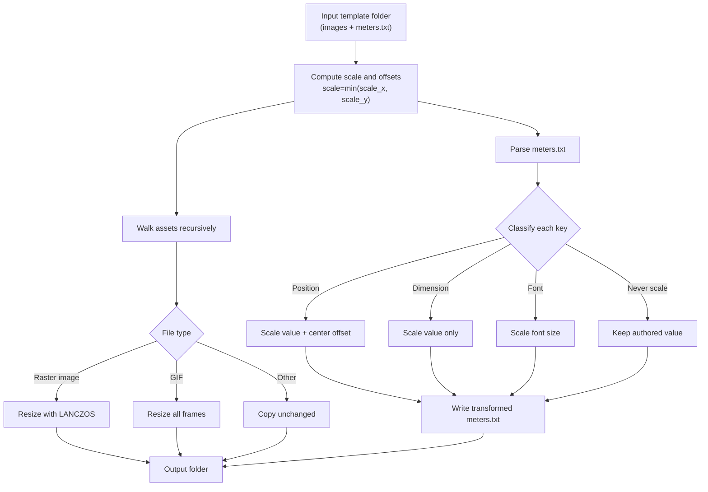
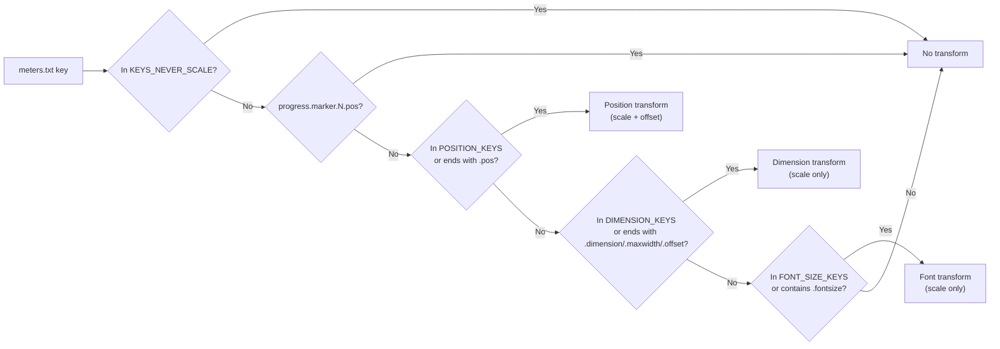

# peppy_rescaler

Template and asset rescaler for PeppyMeter/PeppySpectrum themes.

`peppy_rescaler` converts a source template folder (images + `meters.txt`) to a
target resolution using best-fit scaling with center offsets. It keeps the
folder structure, rescales raster images, and transforms layout values in
`meters.txt` according to classification rules.

This repository currently provides **rescaler version 2.1** (`rescale_template.py`).

## What It Does

- Rescales raster assets (`png`, `jpg`, `jpeg`, `webp`, `bmp`, `tif`, `tiff`, `gif`)
- Copies non-raster files as-is (fonts, docs, misc files)
- Parses `meters.txt` and scales selected numeric keys
- Uses best-fit scaling (`scale = min(scale_x, scale_y)`)
- Applies letterbox/pillarbox offsets to position keys

## What It Does Not Do

- It does not parse `templates_spectrum/.../spectrum.txt`
- It does not edit runtime plugin `config.txt`
- It does not validate artistic quality (manual review still required)

## Requirements

- Python 3.8+
- Pillow

Install:

```bash
python3 -m pip install --upgrade pillow
```

## Quick Start

1. Copy your source template folder into this repo (or point to an absolute path).
1. Edit configuration constants at the top of `rescale_template.py`:
   - `SOURCE_WIDTH`, `SOURCE_HEIGHT`
   - `TARGET_WIDTH`, `TARGET_HEIGHT`
   - `INPUT_FOLDER`, `OUTPUT_FOLDER`
1. Run:

```bash
python3 rescale_template.py
```

1. Review output in `OUTPUT_FOLDER`.

## Configuration

Inside `rescale_template.py`:

- `RESCALER_VERSION` - informational version string (currently `2.1`)
- `SOURCE_WIDTH` / `SOURCE_HEIGHT` - source design resolution
- `TARGET_WIDTH` / `TARGET_HEIGHT` - target design resolution
- `INPUT_FOLDER` - source template folder containing `meters.txt`
- `OUTPUT_FOLDER` - generated folder path

Example:

```python
SOURCE_WIDTH = 1920
SOURCE_HEIGHT = 1080
TARGET_WIDTH = 1280
TARGET_HEIGHT = 720
INPUT_FOLDER = "1920x1080_my_theme"
OUTPUT_FOLDER = "1280x720_my_theme"
```

## Scaling Model

The script computes:

- `scale_x = TARGET_WIDTH / SOURCE_WIDTH`
- `scale_y = TARGET_HEIGHT / SOURCE_HEIGHT`
- `scale = min(scale_x, scale_y)`

Then:

- Position keys: scaled + centered offset
- Dimension keys: scaled only
- Font sizes: scaled only

Offsets:

- `offset_x = (TARGET_WIDTH - SOURCE_WIDTH * scale) / 2`
- `offset_y = (TARGET_HEIGHT - SOURCE_HEIGHT * scale) / 2`

## Visual Overview

### End-to-end pipeline



### Key-classification decision logic (v2.1)



## meters.txt Key Classification (v2.1)

The script classifies keys into:

1. `POSITION_KEYS` - `x,y` style coordinates, e.g.:
   - `meter.x`, `meter.y`
   - `left.origin.x`, `left.origin.y`
   - `albumart.pos`, `playinfo.title.pos`

2. `DIMENSION_KEYS` - sizes/ranges, e.g.:
   - `distance`
   - `step.width.regular`, `step.width.overload`
   - `playinfo.*.maxwidth`

3. `FONT_SIZE_KEYS` - font sizes:
   - `font.size.*`
   - `time.*.fontsize`

4. `KEYS_NEVER_SCALE` - preserved as authored:
   - `steps.per.degree`
   - `ui.refresh.period`
   - `position.regular`, `position.overload`
   - `playinfo.ticker.speed`, `playinfo.ticker.space_between`, `playinfo.ticker.end_spaces`
   - rotation speeds and tonearm durations

Additionally:

- `progress.marker.N.pos` is explicitly preserved (0-100 percentage semantics).

## Asset Handling

- Raster images: resized with `Image.LANCZOS`
- GIFs: all frames resized
- Non-raster files: copied unchanged
- Existing output folder: removed and recreated

## Typical Workflow

1. Run rescaler
1. Open generated `meters.txt`
1. Spot-check critical sections:
   - linear bars and overload zones
   - playinfo text boxes/maxwidth
   - time fields
   - indicator positions
1. Load in target system and visually verify
1. Fine-tune manually where needed

## Troubleshooting

### `ERROR: Input folder not found`

Set `INPUT_FOLDER` correctly (relative to script dir or absolute path).

### `ERROR: meters.txt not found`

Ensure source folder includes a file named exactly `meters.txt`.

### Pillow import error

Install dependencies:

```bash
python3 -m pip install --upgrade pillow
```

### Visual misalignment after scaling

Normal for complex skins. The script gives a strong baseline; final alignment may
need manual adjustments.

## Versioning

- `2.1` - collaboration update: preserve semantic bar-count and ticker keys (no numeric scaling)
- `2.0` - baseline rescaler behavior for this repository

## License

MIT (see `LICENSE`).
